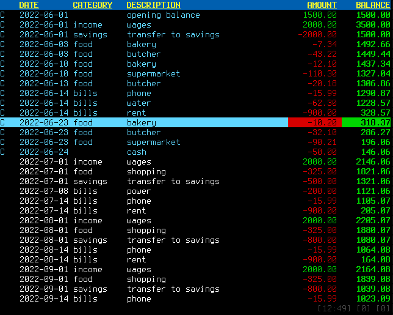

# jcb

A powerful TUI personal budgeting program.


jcb has the design goals of:

1. Input and manipulate data quickly.
1. Report where your money is being spent.
1. Forecast your future bank balance.



## Workflow

Create the transactions, either by importing them from your bank, or creating them in the application.

Categorise your transactions and reconcile against your bank statement.

Commit the record of the transaction. This marks the transaction as read-only and also prevents any other records from being inserted before it.

Use the report to help you make financial decisions.

Repeat.


## Getting Started


## The UI

The user interface has been inspired quite a bit by the Mutt email editor and the Vim text editor.


### Transaction Attributes

Every transaction has a set of three attributes which are displayed in the first column of the transactions table.

Attributes are:

- `C`: Transaction is committed.
- `n`: Transaction has a note.
- `+`: Transaction is modified, but not saved.


### Info Panel

At the bottom-right of your screen you will find an info panel. It provides an overview of the transactions table. It might look something like this:

```
[13:27] [1] [0]
```

That tells you that:
- The thirteenth transaction is selected.
- There are a total of twenty-seven transactions.
- That one transaction has been modified but not saved.
- That zero transactions are tagged.


---

In keeping with the Unix philosophy, it does not connect to your bank at all. Instead, you can produce and import transactions from a TSV file.

It does not manage multiple bank accounts.
